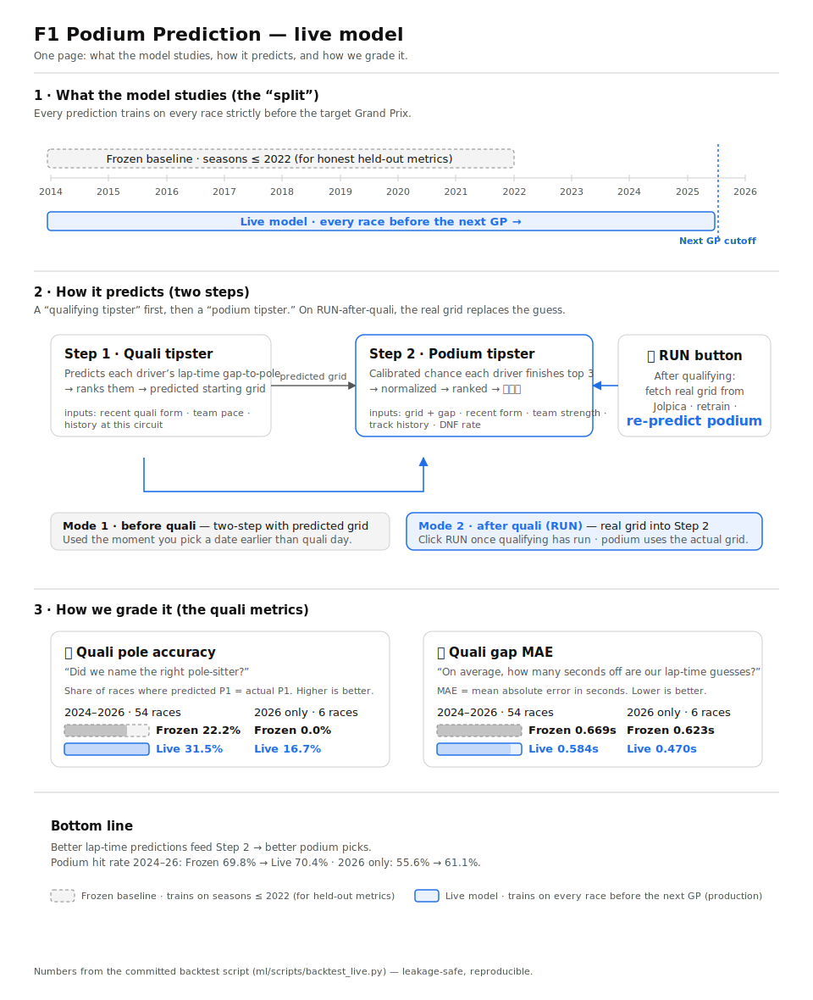

# F1 Prediction Logic

The single source of truth for how the Predict app works — the end-to-end flow, the two
prediction modes (chosen by the user's **as-of date**), and the machine-learning models.

Code: `streamlit_app/app.py` (UI) · `ml/src/model/forecast.py` (pipeline) ·
`ml/src/model/quali.py` (Stage 1) · `ml/src/model/train.py` (Stage 2).

For the data-science detail (algorithms, features, splits, hyperparameters,
live retrain) see [`ml-models.md`](./ml-models.md). For a one-page visual:
[`assets/prediction-flow.svg`](./assets/prediction-flow.svg).



---

## Full logic flow

```
USER picks a date  (app.py: st.date_input)
   │   [▶ RUN button → re-fetch season from Jolpica → RETRAIN both models on every race
   │    before the target GP (leakage-safe) → clear cache + rerun]
   ▼
resolve(date)  →  forecast(date)   (src/model/forecast.py)
   │
   ├─ 1. Find next race ≥ date            (schedule)            → Barcelona, round 7…
   ├─ 2. Keep only data BEFORE that race  (t[date < race_date]) → no leakage
   ├─ 3. Entry list = drivers from the most recent completed race
   ├─ 4. Build each driver's feature row (form signals + qualifying signals)
   │
   ├─ STAGE 1 (quali model) ───────────────┐
   │     predict gap-to-pole → rank → grid │
   │                                        ▼
   ├─ MODE pick by date:        date ≤ quali day → use PREDICTED grid (2-stage)
   │                            date >  quali day → use REAL grid (if cached)
   │                                        │
   ├─ STAGE 2 (podium model) ◄──────────────┘
   │     P(top-3) per driver → normalize (sum=3) → rank → podium
   ▼
race dict {predictedQualifying, preQualifyingPodium, realGridPodium, realQualifying, hasRealGrid}
   ▼
app.py renders → race strip · mode badge · quali_html · podium_html · compare_html  (the design)
                 (+ "📡 Real data from today's qualifying." line when in real-grid mode)
```

---

## Two prediction types (chosen by date)

```
find the NEXT race on/after the date → it has a qualifying date and a race date
      │
      ├── date ≤ qualifying date   → TYPE 1: PRE-QUALIFYING  (two-stage, predicted grid)
      └── date > qualifying date   → TYPE 2: REAL GRID        (uses actual qualifying)
```

Boundary: **on/before** quali day → two-stage; **after** quali day → real grid.
Real grid *also* requires the qualifying to be present in the cache (use the 🔄 Run button
after a session is published).

### TYPE 1 — Pre-qualifying (date ≤ qualifying date): two-stage

**Stage 1 — predict the grid** (`quali_model`, LightGBM regressor)
Inputs (pre-race only, no leakage):
- `quali_track_hist` — qualifying history at this circuit in prior years
- `recent_quali_gap`, `recent_quali_pos` — recent qualifying form / recent average grid
- `team_quali_strength` — team's recent qualifying pace

Output: predicted **gap-to-pole** per driver → rank → **predicted grid**.

**Stage 2 — predict the podium** (`podium_model`, calibrated LightGBM classifier)
Inputs:
- the **predicted grid** from Stage 1 (`grid_position`, `quali_time_gap_to_pole`)
- `recent_form`, `recent_points` (recent form)
- `team_strength`, `track_history`, `dnf_rate` (team, track, reliability)

Output: **P(top-3)** per driver → normalize (sum = 3) → rank → **predicted podium**.

### TYPE 2 — Real grid (date > qualifying date): one stage

Skip Stage 1. Use the **actual qualifying** (real grid position + real gap-to-pole) in
place of the predicted grid, then run the **same** Stage-2 podium model with the same
form/team/track/reliability features → **podium on the real grid**. A **Compare** panel
shows predicted grid vs actual grid with ▲/▼ movement, and the app shows the line
**"📡 Real data from today's qualifying."**

---

## Machine-learning models

| Role | Code | Algorithm | Predicts | Calibrated | Trained on |
|---|---|---|---|---|---|
| **Stage 1 — Qualifying (live)** | `retrain.train_quali_live` | **LightGBM regressor** | gap-to-pole (s) → grid | n/a | every race before the target GP |
| **Stage 2 — Podium (live)** | `retrain.train_podium_live` | **LightGBM classifier** | P(top-3) | **yes** (sigmoid, 5-fold CV) | every race before the target GP |
| Held-out metrics — Stage 2 | `train.py` | LightGBM + Logistic baseline + XGBoost benchmark | P(top-3) | sigmoid (on 2023) | ≤2022 fit · 2023 calib · ≥2024 test |
| Held-out metrics — Stage 1 | `quali.train_quali` | LightGBM regressor | gap-to-pole (s) | n/a | ≤2022 fit · ≥2024 test |

Discipline: **no leakage** (features use only pre-race data, `shift(1)` in training),
probabilities **calibrated**. The "held-out metrics" trainers exist only to populate
the metrics page (`metrics.json`, `quali_metrics.json`) — they do not serve predictions.
See [`ml-models.md`](./ml-models.md) for the full data-science reference.

### How the podium is produced (Stage 2)
```python
p = podium_model.predict_proba(X)[:, 1]   # calibrated P(top-3) per driver
p = p * 3 / p.sum()                        # normalize: ~20 drivers sum to 3 podium spots
# sort desc → top 3 = predicted podium; #1 (highest podium prob) = predicted winner
```
Each driver is scored independently, then normalized per race and ranked. (Podium-only
model; the "winner" is the top of the podium — `top1Accuracy` is reported separately.)

### Measured accuracy (test 2024–2026)
grid error **±3.4** positions · podium hit rate **70%** · gap MAE **0.60s** · **182**
training races. Benchmarks: LightGBM AUC 0.935, XGBoost 0.937 (a statistical tie), both
beat the logistic baseline → **LightGBM shipped** (stronger top-1 accuracy).

---

## Data flow / live update

```
Jolpica API ──(▶ RUN: fetch refresh)──▶ ml/data/raw/*.parquet ──▶ RETRAIN ──▶ app
```

Predictions run **live** in the app from the **cached** parquet. The cache changes only on
refresh. The ▶ RUN button does: re-fetch season (`refresh=True`) → **retrain both models on
the new data** → `st.cache_data.clear()` → `st.rerun()` → `forecast(models=…)` re-predicts →
mode flips 🟡→🟢 if qualifying is now present and date > quali day.

### Live retrain
On every prediction, `src/model/retrain.py` refits **both** stages on **every race strictly
before the target GP** (expanding window, leakage-safe). The podium probabilities are
calibrated with **5-fold CV sigmoid** (no held-out season, so recent races train the trees
too). Features are built **in memory** (`build_feature_table` / `build_quali_features`),
so it does not need the gitignored `data/processed/features.parquet`.

- **Caching:** `app.py` keys an `st.cache_resource` on a raw-data fingerprint + target race,
  so a RUN that fetched new data retrains **once** (~10–17s podium / ~20–35s both on Streamlit
  Cloud); date changes and reruns are instant cache hits.
- **First paint:** `web/public/data/next_race_prediction.json` (written by
  `scripts/precompute_next_race.py`) is served instantly when its race matches today's
  next-race. When it doesn't match (e.g. user picks a future race), `forecast()` retrains
  inline — one-time spinner, then cached.
- **Why:** backtests (`scripts/backtest_live.py`) show recency helps — podium hit rate up
  (biggest on 2026), quali pole accuracy 22%→31%, gap MAE 0.67s→0.58s over 2024–26.
- **Accuracy bar:** shows the live model's **walk-forward backtest** over 2024–26
  (`live_metrics.json`, from `scripts/backtest_live.py --write`) — leakage-safe and
  representative of the production regime. (The separate Next.js metrics page still
  uses the held-out `metrics.json` / `quali_metrics.json`.)

| Moment (predicting Race N) | Needs | Action |
|---|---|---|
| Before qualifying (Type 1) | races 1…N−1 | refresh after Race N−1 |
| After qualifying (Type 2) | + Race N's **qualifying** | 🔄 Run after qualifying → unlocks real grid |
| After the race | + Race N's **result** | 🔄 Run after the race (to compare) |

Notes:
- The button only fetches what Jolpica has **published** (qualifying appears a few hours
  after the real session). Click after qualifying → real grid; click before → stays
  pre-qualifying (expected).
- Models retrain on every prediction (cached aggressively). The offline trainers
  (`train_model.py`, `build_quali_model.py`) still produce the held-out metrics for the
  metrics page — they don't serve predictions.
- macOS: LightGBM/XGBoost need `libomp` — run `bash ml/scripts/fix_libomp_macos.sh` if an
  import fails after recreating the venv.
